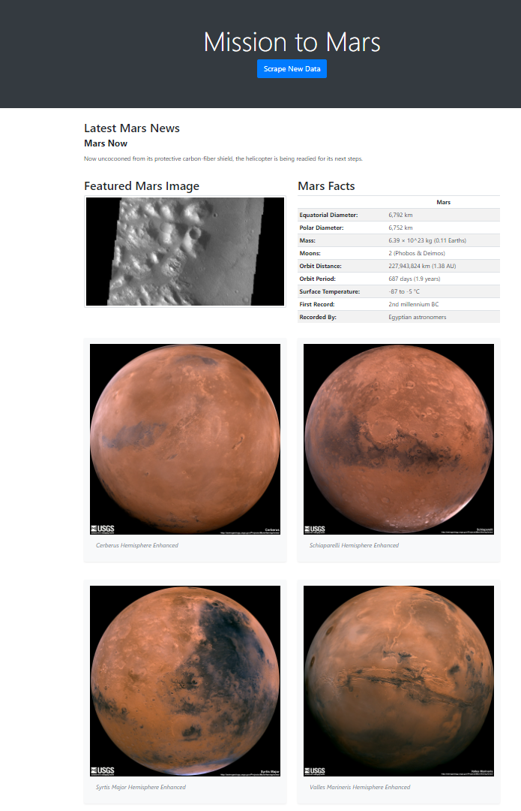

# web-scraping-challenge
This challenge was divided in two steps: Scraping and creation of an HTML page using MongoDB and Flask Application. \
The ultimate goal is the development of a web application that scrapes various websites to retrieve data related to the Mission to mars and displays the information in a single HTML page.

# 1. Scraping
The scraping script was optimized using [Jupyter notebook](./Mission_to_Mars/mission_to_mars.ipynb). The notebook was then exported as a [python script](./Mission_to_Mars/scrape_mars.py) and adapted to be run as a function. \
The developed scripts uses [BeautifulSoup](https://www.crummy.com/software/BeautifulSoup/bs4/doc/), [splinter](https://splinter.readthedocs.io/en/latest/) and [pandas](https://pandas.pydata.org/docs/reference/api/pandas.read_html.html).
The following websites were scraped:
 * [NASA](https://mars.nasa.gov/news/)
    The latest news information was scraped.
 * [JPL Mars Space Images](https://data-class-jpl-space.s3.amazonaws.com/JPL_Space/index.html)
    The featured Image was scraped.
 * [Mars Facts](https://space-facts.com/mars/)
    The table containing Mars information was scraped.
 * [Mars Hemispheres](https://astrogeology.usgs.gov/search/results?q=hemisphere+enhanced&k1=target&v1=Mars)
    High resolution images of each of Mars' hemisphere were scraped.
# 2. MongoDB and Flask Application
- The jupyter notebook was adapted to be used as a function reported in [python script](./Mission_to_Mars/scrape_mars.py). 
- A database called mission_to_mars containing a collection called mars were created by using [MongoDB Compass](https://www.mongodb.com/products/compass). 
  * The database needs to be created before-hand only if you use pymongo and this type of connection:
  ```python
    import pymongo
    conn = "mongodb://localhost:27017/mission_to_mars"
    client = pymongo.MongoClient(conn)
    ```
   * The creation of the database is not necessary if PyMongo is used and the connection is coded as:
   ```python
   from flask_pymongo import PyMongo
   conn = "mongodb://localhost:27017/mission_to_mars"
   client = PyMongo(app, uri=conn)
   ````
  _**Another important difference between the two approaches to the problem is that with the first one your database is not updated with the scraped information while in the second it is created and updated automatically.**_
  
- [app.py](./Mission_to_Mars/app.py) was developed with two paths:
    1. The home root is rendering the database using the [html](./Mission_to_Mars/Templates/index.html) file created using [bootstraps](https://getbootstrap.com/docs/5.0/examples/).
    ```python
    @app.route("/")
    def index():
        mars = client.db.mars.find_one()
        return render_template( "index.html", mars=mars)
     ```
     2. The second root is doing the scraping in the background the first time the web page is opened and every time the button is clicked.
     ```python
        @app.route("/scrape")
        def scraper():
            mars = client.db.mars
            mars_data = scrape_mars.scrape()
            mars.update({}, mars_data,upsert=True)
            return redirect("/", code=302)
    

# HTML Page

